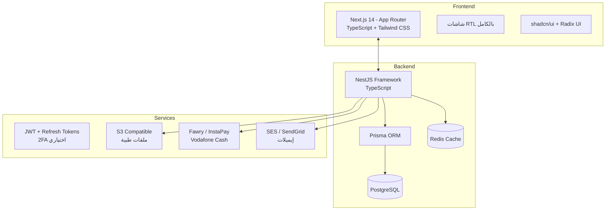

# التصميم المعماري للنظام

## 1. نظرة عامة على التقنيات (Tech Stack)



### التقنيات المقترحة

| الطبقة | التقنية | السبب |
|--------|---------|-------|
| Frontend | Next.js 14 + TypeScript | SSR لدعم SEO (Landing Pages)، RTL جاهز، أداء عالي |
| UI Framework | Tailwind CSS + shadcn/ui | تطوير سريع، دعم RTL، مكونات جاهزة قابلة للتخصيص |
| Backend | NestJS + TypeScript | معماري (Modular)، DI، scalable، نوع آمن |
| Database | PostgreSQL 16 | بيانات علائقية قوية، JSON support، ACID |
| ORM | Prisma | Type-safe queries، auto-migration، رائع مع TypeScript |
| Cache | Redis | جلسات، تخزين مؤقت، rate limiting |
| Queue | Bull (Redis) | إشعارات، إيميلات، مهام خلفية |
| Auth | JWT (access + refresh) | صلاحيات مرنة، 2FA اختياري |
| Payment | Fawry / InstaPay API | مدفوعات مصرية محلية |
| Hosting | Docker + DigitalOcean / AWS | scalable حسب الطلب |
| CI/CD | GitHub Actions | Deploy تلقائي |

## 2. معمارية Multi-Tenant

```
┌─────────────────────────────────────────────┐
│                 API Gateway                  │
│         Rate Limiting / Auth Guard          │
└─────────────────────────────────────────────┘
                      │
        ┌─────────────┼─────────────┐
        ▼             ▼             ▼
┌──────────────┐ ┌──────────┐ ┌──────────┐
│  Clinic A    │ │ Clinic B │ │ Clinic C │  ← كل عيادة Tenant منفصل
│ (tenant_1)   │ │(tenant_2)│ │(tenant_3)│
└──────────────┘ └──────────┘ └──────────┘
        │             │             │
        └─────────────┼─────────────┘
                      ▼
              ┌──────────────┐
              │  PostgreSQL  │
              │  shared DB   │
              │  clinic_id   │  ← Isolation بالمفتاح clinic_id
              └──────────────┘
```

**استراتيجية العزل**: Shared Database, Shared Schema مع `clinicId` في كل جدول (مناسبة لـ 1000+ عيادة)

## 3. تدفق البيانات الأساسي

### تسجيل الدخول
```
Client → /auth/login → JWT Guard → Dashboard
         │              │
         ▼              ▼
    Validate creds   Generate JWT
    Check trial/     (role + clinicId
    subscription     مشفرين في payload)
```

### سير عمل الحجز
```
Patient comes → Receptionist logs in
              → Opens Calendar
              → Searches/Creates Patient
              → Selects time slot
              → Confirms appointment
              → Saves → Email/SMS notification (future)
```

## 4. مبادئ التصميم

- **RTL First**: كل واجهات المستخدم مصممة من البداية للغة العربية
- **Mobile Responsive**: تعمل على tablets (معظم العيادات تستخدم تابلت)
- **Offline Resilient**: PWA-ready للمرحلة الثانية
- **Optimistic UI**: تحديث فوري للواجهة قبل تأكيد السيرفر
- **Accessibility**: WCAG 2.1 AA
