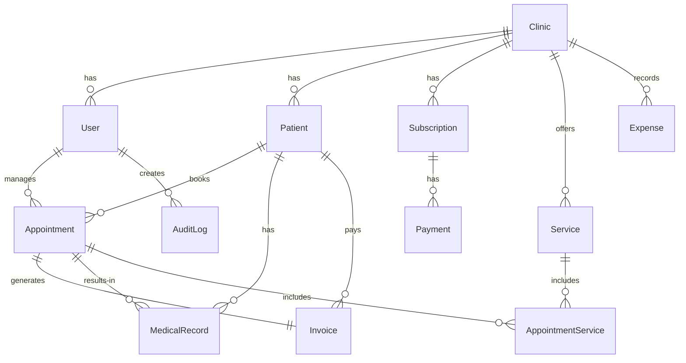

# تصميم قاعدة البيانات

## 1. مخطط العلاقات الأساسي (ERD)



## 2. هيكل الجداول

### clinic (العيادات - Tenants)
```prisma
model Clinic {
  id              String   @id @default(cuid())
  nameArabic      String   // الاسم بالعربية
  nameEnglish     String?  // الاسم بالإنجليزية
  slug            String   @unique // للرابط المخصص
  logo            String?
  phone           String
  email           String?
  address         String
  licenseNumber   String?  // رقم ترخيص العيادة
  timezone        String   @default("Africa/Cairo")
  workingDays     Json     // { sat: "9-5", sun: "9-5", ... }
  isActive        Boolean  @default(true)
  
  // إعدادات الباقة
  subscriptionTier Tier    @default(STARTER)
  trialEndsAt      DateTime?
  isTrial          Boolean  @default(true)
  subscriptionStatus Status @default(TRIAL)
  
  // تخصيص Premium
  primaryColor    String?  // اللون الأساسي
  secondaryColor  String?  // اللون الثانوي
  
  createdAt DateTime @default(now())
  updatedAt DateTime @updatedAt
  
  // Relations
  users        User[]
  patients     Patient[]
  appointments Appointment[]
  services     Service[]
  expenses     Expense[]
  subscription Subscription[]
  auditLogs    AuditLog[]
}

enum Tier { STARTER PROFESSIONAL PREMIUM }
enum Status { TRIAL ACTIVE EXPIRED CANCELLED PAST_DUE }
```

### user (المستخدمين)
```prisma
model User {
  id            String   @id @default(cuid())
  clinicId      String
  name          String
  email         String   @unique
  phone         String?
  passwordHash  String
  role          Role     @default(RECEPTIONIST)
  isActive      Boolean  @default(true)
  twoFactorEnabled Boolean @default(false)
  twoFactorSecret  String?
  
  // أمان
  lastLoginAt   DateTime?
  loginAttempts Int      @default(0)
  lockedUntil   DateTime?
  
  createdAt DateTime @default(now())
  updatedAt DateTime @updatedAt
  
  // Relations
  clinic       Clinic       @relation(fields: [clinicId], references: [id])
  appointments Appointment[]
  auditLogs    AuditLog[]
  
  @@unique([clinicId, email])
}

enum Role { ADMIN DOCTOR RECEPTIONIST ACCOUNTANT }
```

### patient (المرضى)
```prisma
model Patient {
  id         String   @id @default(cuid())
  clinicId   String
  fileNumber Int      // رقم الملف التلقائي (auto-increment per clinic)
  name       String
  phone      String
  secondPhone String?
  age        Int?
  gender     Gender?
  address    String?
  email      String?
  occupation String?
  
  // تصنيف
  patientType PatientType @default(NEW) // NEW / FOLLOW_UP / EMERGENCY
  
  // آخر زيارة
  lastVisitAt DateTime?
  totalVisits Int         @default(0)
  
  // طبي (يظهر حسب الباقة)
  notes      String?     // ملاحظات عامة
  allergies  String?     // حساسية
  bloodType  String?
  
  createdAt DateTime @default(now())
  updatedAt DateTime @updatedAt
  
  // Relations
  clinic         Clinic          @relation(fields: [clinicId], references: [id])
  appointments   Appointment[]
  medicalRecords MedicalRecord[]
  invoices       Invoice[]
  
  @@unique([clinicId, fileNumber])
  @@unique([clinicId, phone])
  @@index([clinicId, name])
}

enum Gender { MALE FEMALE }
enum PatientType { NEW FOLLOW_UP EMERGENCY }
```

### appointment (المواعيد)
```prisma
model Appointment {
  id           String   @id @default(cuid())
  clinicId     String
  patientId    String
  doctorId     String   // معرف الطبيب (User with role DOCTOR)
  createdById  String   // المستخدم الذي أنشأ الموعد
  
  date         DateTime  // تاريخ الموعد
  startTime    DateTime  // وقت البداية
  endTime      DateTime  // وقت النهاية
  
  status       AppointmentStatus @default(CONFIRMED)
  // CONFIRMED | CANCELLED | COMPLETED | NO_SHOW
  
  source       BookingSource @default(CLINIC)
  // CLINIC | ONLINE | PHONE
  
  cancelReason String?
  notes        String?   // ملاحظات الموعد
  
  // الربط المالي
  fee          Float     @default(0) // قيمة الكشف
  discount     Float     @default(0)
  discountType DiscountType? // PERCENTAGE | FIXED
  total        Float     @default(0)
  
  createdAt DateTime @default(now())
  updatedAt DateTime @updatedAt
  
  // Relations
  clinic            Clinic             @relation(fields: [clinicId], references: [id])
  patient           Patient            @relation(fields: [patientId], references: [id])
  doctor            User               @relation("doctor_appointments", fields: [doctorId], references: [id])
  createdBy         User               @relation("created_appointments", fields: [createdById], references: [id])
  invoice           Invoice?
  appointmentServices AppointmentService[]
  medicalRecords    MedicalRecord[]
  
  @@index([clinicId, date])
  @@index([doctorId, date])
  @@index([patientId])
}

enum AppointmentStatus { CONFIRMED CANCELLED COMPLETED NO_SHOW }
enum BookingSource { CLINIC ONLINE PHONE }
enum DiscountType { PERCENTAGE FIXED }
```

### medical_record (السجل الطبي - Professional+)
```prisma
model MedicalRecord {
  id            String   @id @default(cuid())
  clinicId      String
  patientId     String
  appointmentId String?
  doctorId      String
  
  diagnosis     String?  // التشخيص
  prescriptions String?  // الوصفة /治疗方法
  notes         String?  // ملاحظات الطبيب
  vitalSigns    Json?    // { bloodPressure, temperature, heartRate, weight }
  
  // المرفقات
  attachments   Json?    // [{ name: "تحليل دم", url: "...", type: "pdf" }]
  
  createdAt DateTime @default(now())
  updatedAt DateTime @updatedAt
  
  // Relations
  clinic      Clinic      @relation(fields: [clinicId], references: [id])
  patient     Patient     @relation(fields: [patientId], references: [id])
  appointment Appointment? @relation(fields: [appointmentId], references: [id])
  doctor      User        @relation(fields: [doctorId], references: [id])
  
  @@index([clinicId, patientId])
}
```

### invoice (الفواتير)
```prisma
model Invoice {
  id            String   @id @default(cuid())
  clinicId      String
  patientId     String
  appointmentId String?
  createdById   String
  
  invoiceNumber Int      @default(autoincrement())
  
  // التحصيل
  amount        Float    // إجمالي الفاتورة
  discount      Float    @default(0)
  discountType  DiscountType?
  paidAmount    Float    @default(0)
  status        InvoiceStatus @default(PENDING)
  // PENDING | PAID | PARTIAL | CANCELLED
  
  paymentMethod PaymentMethod? // CASH | CARD | WALLET | TRANSFER
  // ملاحظة: الدفع الإلكتروني يتم عبر Payment Gateway
  
  // إغلاق اليومية
  isClosed      Boolean  @default(false)
  closedAt      DateTime?
  closedBy      String?
  
  createdAt DateTime @default(now())
  updatedAt DateTime @updatedAt
  
  // Relations
  clinic      Clinic      @relation(fields: [clinicId], references: [id])
  patient     Patient     @relation(fields: [patientId], references: [id])
  appointment Appointment? @relation(fields: [appointmentId], references: [id])
  createdBy   User        @relation(fields: [createdById], references: [id])
  services    InvoiceService[]
  
  @@index([clinicId, createdAt])
}

enum InvoiceStatus { PENDING PAID PARTIAL CANCELLED }
enum PaymentMethod { CASH CARD WALLET TRANSFER }
```

### service (الخدمات الطبية)
```prisma
model Service {
  id          String   @id @default(cuid())
  clinicId    String
  name        String   // اسم الخدمة
  price       Float    // السعر
  description String?
  isActive    Boolean  @default(true)
  
  createdAt DateTime @default(now())
  updatedAt DateTime @updatedAt
  
  // Relations
  clinic                Clinic                @relation(fields: [clinicId], references: [id])
  appointmentServices   AppointmentService[]
  invoiceServices       InvoiceService[]
  
  @@unique([clinicId, name])
}
```

### appointment_service (خدمات الموعد)
```prisma
model AppointmentService {
  id            String @id @default(cuid())
  appointmentId String
  serviceId     String
  quantity      Int    @default(1)
  priceAtTime   Float  // سعر الخدمة وقت الحجز
  subtotal      Float
  
  appointment Appointment @relation(fields: [appointmentId], references: [id])
  service     Service     @relation(fields: [serviceId], references: [id])
  
  @@unique([appointmentId, serviceId])
}
```

### expense (المصروفات - Premium)
```prisma
model Expense {
  id          String   @id @default(cuid())
  clinicId    String
  category    ExpenseCategory
  amount      Float
  description String
  receiptUrl  String?  // صورة الإيصال
  date        DateTime
  createdById String
  
  createdAt DateTime @default(now())
  
  // Relations
  clinic    Clinic @relation(fields: [clinicId], references: [id])
  createdBy User   @relation(fields: [createdById], references: [id])
  
  @@index([clinicId, date])
}

enum ExpenseCategory { RENT SALES_WAGES ELECTRICITY WATER INTERNET SUPPLIES MAINTENANCE MARKETING OTHER }
```

### subscription (الاشتراكات)
```prisma
model Subscription {
  id           String   @id @default(cuid())
  clinicId     String
  tier         Tier     @default(STARTER)
  startDate    DateTime
  endDate      DateTime
  amount       Float
  status       Status   @default(ACTIVE)
  isAnnual     Boolean  @default(false)
  autoRenew    Boolean  @default(true)
  
  // إضافات
  hasLandingPage Boolean @default(false)
  hasPremiumSupport Boolean @default(false)
  
  createdAt DateTime @default(now())
  updatedAt DateTime @updatedAt
  
  // Relations
  clinic  Clinic   @relation(fields: [clinicId], references: [id])
  payments Payment[]
  
  @@index([clinicId, status])
}
```

### payment (المدفوعات)
```prisma
model Payment {
  id              String   @id @default(cuid())
  subscriptionId  String
  clinicId        String
  amount          Float
  paymentMethod   PaymentMethod
  transactionId   String?  // من Gateway
  status          PaymentStatus @default(PENDING)
  // PENDING | COMPLETED | FAILED | REFUNDED
  paidAt          DateTime?
  
  createdAt DateTime @default(now())
  
  // Relations
  subscription Subscription @relation(fields: [subscriptionId], references: [id])
  clinic      Clinic       @relation(fields: [clinicId], references: [id])
}

enum PaymentStatus { PENDING COMPLETED FAILED REFUNDED }
```

### audit_log (سجل التدقيق)
```prisma
model AuditLog {
  id        String   @id @default(cuid())
  clinicId  String
  userId    String
  action    String   // CREATE | UPDATE | DELETE | LOGIN | LOGOUT
  entity    String   // "patient" | "appointment" | "invoice"
  entityId  String?  // الـ id الخاص بالكيان
  oldValue  Json?    // القيمة القديمة
  newValue  Json?    // القيمة الجديدة
  ipAddress String?
  userAgent String?
  
  createdAt DateTime @default(now())
  
  // Relations
  clinic Clinic @relation(fields: [clinicId], references: [id])
  user   User   @relation(fields: [userId], references: [id])
  
  @@index([clinicId, createdAt])
  @@index([clinicId, entity])
  @@index([clinicId, userId])
}
```

## 3. ملاحظات الأداء

- **Indexes**: كل جدول عنده index على `clinicId` (الشرط الأساسي في كل Query)
- **Soft Deletes**: بنستخدم `isActive` أو `deletedAt` مش حذف فعلي
- **تاريخ المواعيد**: نخزن `startTime` و `endTime` كـ DateTime عشان نحسب المدة ونمنع التعارض
- **JSON Fields**: للحقول المتغيرة (vital signs, attachments, settings)
- **Auto-increment per clinic**: `fileNumber` و `invoiceNumber` يبدؤوا من 1 لكل عيادة
