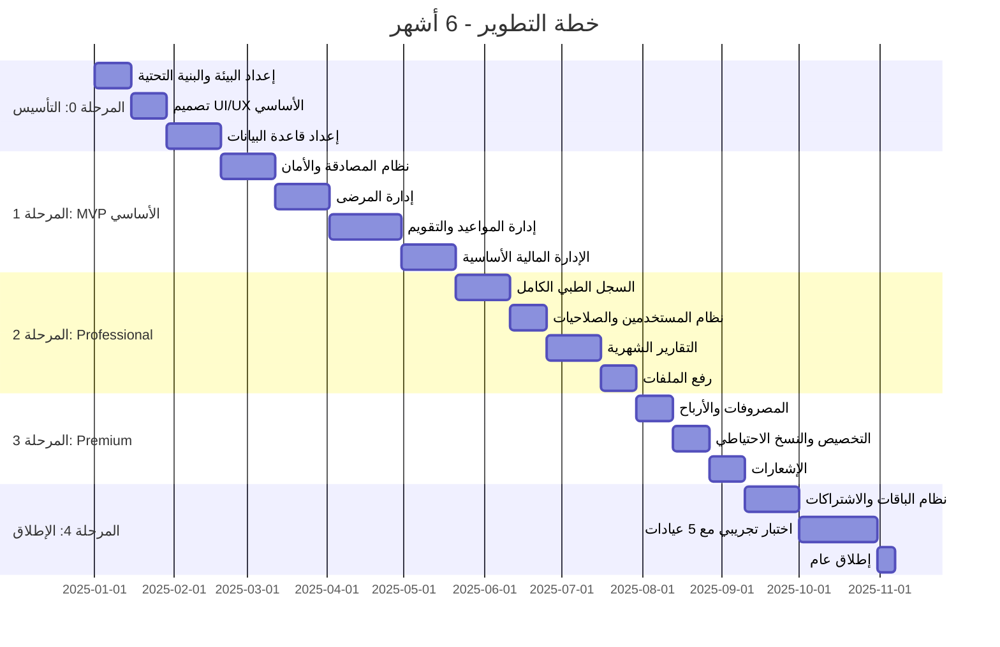

# خارطة الطريق التنفيذية (MVP Roadmap)

## 1. المراحل الزمنية

## 2. المهام التفصيلية لكل مرحلة

### المرحلة 0: التأسيس (أسبوعان)
- [ ] إنشاء monorepo مع Turborepo
- [ ] إعداد Next.js مع TypeScript و Tailwind
- [ ] إعداد NestJS مع Prisma
- [ ] إعداد Docker + docker-compose
- [ ] إعداد GitHub repository + CI/CD
- [ ] إعداد PostgreSQL في development
- [ ] تثبيت shadcn/ui مع RTL
- [ ] إعداد i18n (next-intl)
- [ ] **تسليم**: مشروع يشتغل local مع Hello World

### المرحلة 1: MVP الأساسي (10 أسابيع)

**الأسبوع 3-4: نظام المصادقة**
- [ ] نموذج تسجيل عيادة جديدة + تجربة 7 أيام
- [ ] تسجيل الدخول (JWT access + refresh)
- [ ] تسجيل الخروج
- [ ] نسيان كلمة المرور
- [ ] واجهات Auth (Login, Register, Reset Password)

**الأسبوع 5-7: إدارة المرضى**
- [ ] CRUD المرضى
- [ ] بحث بالاسم ورقم التليفون ورقم الملف
- [ ] عرض تاريخ الزيارات
- [ ] تصنيف المريض (جديد / متابعة / طارئ)
- [ ] Auto-increment رقم الملف لكل عيادة

**الأسبوع 8-11: إدارة المواعيد**
- [ ] تقويم تفاعلي يومي/أسبوعي
- [ ] إنشاء وتعديل وإلغاء المواعيد
- [ ] منع تعارض المواعيد (لنفس الطبيب)
- [ ] حالات الموعد (مؤكد – ملغي – تم – لم يحضر)
- [ ] عرض تقويم الطبيب

**الأسبوع 12-14: الإدارة المالية الأساسية**
- [ ] تسجيل قيمة الكشف
- [ ] إضافة خدمات إضافية
- [ ] خصومات (نسبة / مبلغ)
- [ ] إجمالي اليومي
- [ ] إقفال اليومية
- [ ] طباعة إيصال بسيط

### المرحلة 2: ميزات Professional (10 أسابيع)

**الأسبوع 15-17: السجل الطبي**
- [ ] سجل طبي كامل (تشخيص – وصفة – ملاحظات)
- [ ] Vitals (الضغط – الحرارة – النبض)
- [ ] عرض تاريخ السجل الطبي

**الأسبوع 18-19: نظام المستخدمين**
- [ ] دعوة مستخدمين جدد
- [ ] إدارة الأدوار (Admin / Doctor / Receptionist)
- [ ] تحديد صلاحيات كل دور

**الأسبوع 20-22: التقارير**
- [ ] تقرير شهري مفصل
- [ ] مقارنة الشهور
- [ ] أكثر الخدمات طلباً
- [ ] أداء الأطباء
- [ ] تصدير PDF + Excel

**الأسبوع 23-24: ملفات ورفع**
- [ ] رفع تحاليل وأشعة
- [ ] معاينة الملفات
- [ ] تخزين آمن

### المرحلة 3: ميزات Premium (6 أسابيع)

**الأسبوع 25-26: الإدارة المالية المتقدمة**
- [ ] المصروفات والفئات
- [ ] تقرير الأرباح والخسائر
- [ ] إيصالات احترافية

**الأسبوع 27-28: التخصيص والنسخ الاحتياطي**
- [ ] تخصيص الألوان والشعار
- [ ] نسخ احتياطي تلقائي
- [ ] استعادة النسخ

**الأسبوع 29-30: الإشعارات**
- [ ] إشعارات داخلية
- [ ] إيميلات (تذكير مواعيد)

### المرحلة 4: الإطلاق (8 أسابيع)

**الأسبوع 31-33: نظام الباقات**
- [ ] تكامل بوابات الدفع (Fawry, InstaPay, Vodafone Cash)
- [ ] نظام الباقات الثلاث
- [ ] التجربة المجانية → تحويل لمدفوع
- [ ] الترقية بين الباقات
- [ ] إلغاء الاشتراك
- [ ] كوبونات خصم

**الأسبوع 34-37: اختبار تجريبي**
- [ ] اختبار مع 5-10 عيادات حقيقية
- [ ] جمع feedback
- [ ] إصلاح bugs
- [ ] تحسين الأداء

**الأسبوع 38: إطلاق عام**

## 3. MVP (الحد الأدنى للإطلاق)

**ما يدخل في MVP (أول إصدار):**
- ✅ تسجيل العيادة + تجربة 7 أيام
- ✅ إدارة المرضى (CRUD + بحث)
- ✅ إدارة المواعيد (تقويم + منع تعارض)
- ✅ الإدارة المالية (كشف + خدمات + إقفال يومي)
- ✅ إيصال طباعة
- ✅ التقرير اليومي
- ✅ مستخدم واحد (Admin فقط - Starter)
- ✅ واجهة عربية كاملة
- ✅ دعم الباقة الأساسية فقط في البداية

**ما يتأخر للمرحلة الثانية:**
- ❌ السجل الطبي (Professional)
- ❌ المستخدمين المتعددين
- ❌ التقارير الشهرية
- ❌ المصروفات
- ❌ حجوزات أونلاين
- ❌ Landing Page

## 4. مؤشرات نجاح MVP

| المقياس | الهدف |
|---------|-------|
| وقت تسجيل عيادة جديدة | < 5 دقائق |
| وقت حجز موعد (من الدخول للتقويم) | < 30 ثانية |
| زمن تحميل الصفحات | < 2 ثانية |
| Zero Downtime أثناء ساعات العمل | 99.5% |
| 0 تعارضات مواعيد | 100% |

## 5. فريق التطوير المقترح

| الدور | العدد | المسؤولية |
|-------|-------|-----------|
| Full-Stack Developer | 2 | Backend + Frontend |
| UI/UX Designer | 1 | التصميم وواجهات المستخدم |
| Product Owner | 1 | تحديد الأولويات والتواصل |
| QA Tester | 1 (جزئي) | اختبار الجودة |
